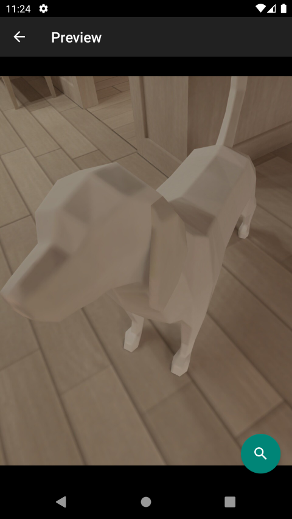
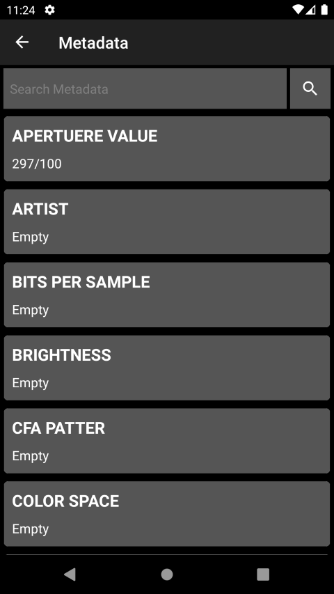

# ExifReader

ExifReader is open source, read metadata from picture.

# Features

- display picture gallery.
- read metadata.
- search metadata.

| |  |  |
| -- | -- | -- |

# Download

# License

ExifReader is released under the GNU General Public License v3.0 (GPLv3)
